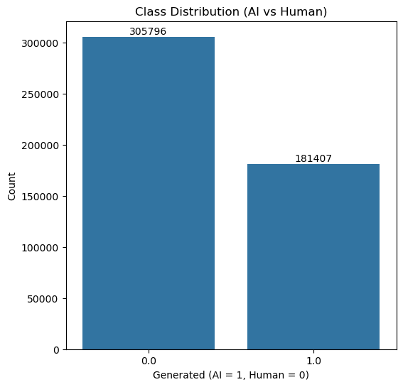
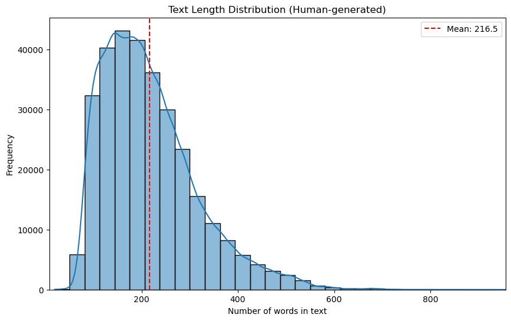
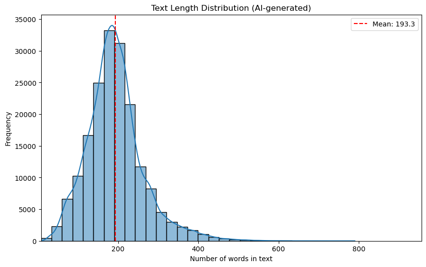
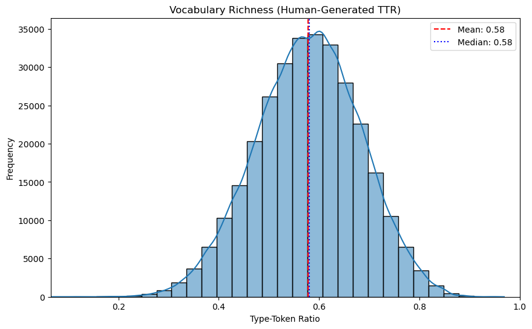
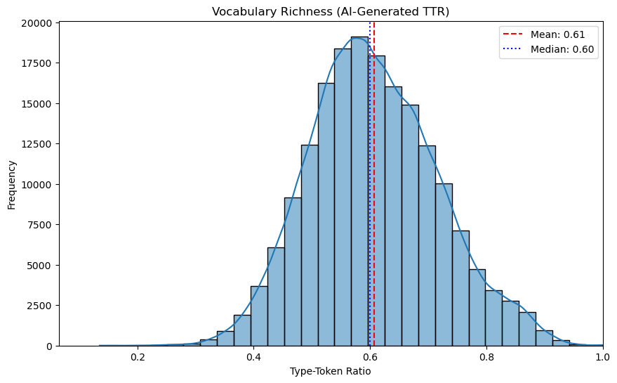
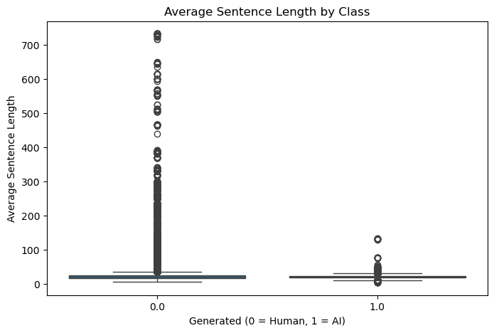
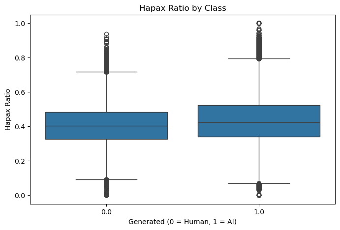
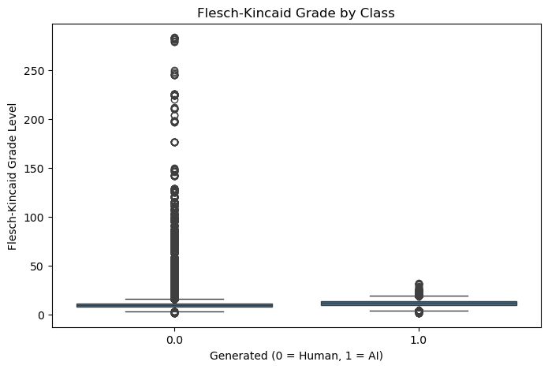

# SEA820 Natural Language Processing - Final Project Report
Dayson Dong 

Due: 2025-08-09

## Section 1: Dataset Used

Two datasets were used in the project:

- [AI Vs Human Text](https://www.kaggle.com/datasets/shanegerami/ai-vs-human-text/data)

    - Contains 487,235 rows of data, with 305,797 instances of human text and 181,438 instances of AI generated text
    
    - Used for training in this project.

- [AI Generated Text Dataset](https://www.kaggle.com/datasets/denvermagtibay/ai-generated-essays-dataset?select=AI+Generated+Essays+Dataset.csv)

    - Contains a total of 1,460 samples with 1,375 human samples and 85 AI samples.

    - Used for additional evaluation in this project.

- [Human vs. LLM Text Corpus](https://www.kaggle.com/datasets/starblasters8/human-vs-llm-text-corpus)

    - Contains a total of 788,922 samples with 44% human samples and 56% AI samples.

    - 20,000 values from each labels (human and AI generated) were selected and used for additional evaluation of the models

## Section 2: EDA (Exploratory Data Analysis)

*Note*: Find the Draft Code [here](./notebooks/draft_EDA.ipynb)

In the section, we explore the **AI Vs Human Text** dataset in various aspects.

### 2.1 Class Distribution

The class distribution is visualized in a bar chart. It's evident that the dataset is imbalanced - there're more samples of **human** text than **AI generated** text, which means that during training or fine-tuning, we might need to balance the dataset or use different weights for different classes.



### 2.2 Text Length Analysis

Before the text length visualization is performed, the texts are pre-processed using the following pipeline:

    1. Lowercases the input text.
    2. Tokenizes the text into words.
    3. Removes English stopwords and non-alphanumeric tokens (e.g., punctuation).
    4. Applies either lemmatization to the remaining words.
    5. Joins the processed words back into a single string.

Finally, the results are store in the new `tokens` column and the length (number of tokens) of each sample is visualized:

<div>


</div>


In the above plots, we could see that:

- On average, the lengths are around 200 with human samples being a bit longer than AI samples

- AI texts are more uniform in length while human samples show greater variability

**Interpretation**: AI model tend to stick to prompt length limits or training patterns while human tend to write with greater variability in structures etc.


### 2.3 Vocabulary Richness (TTR: Type-Token Ratio)

**TTR**, or **Type-Token Ratio** is a metric use to measure vocabulary richness or lexical diversity in a piece of text.

$$
TTR = \frac{\text{Number of unique words (types)}}{\text{Total number of words (tokens)}}
$$

<div>


</div>

The distributions of both classes look similar, with AI-generated texts have a slightly higher average Type-Token Ratio (TTR) (~0.61) compared to human-generated texts (~0.58), indicating marginally richer vocabulary usage.

### 2.4 Average Sentence Length

The follow box plot compares the average sentence length of human-generated texts (0) and AI-generated texts (1).




The plot shows that human-generated texts tend to have longer and more varied average sentence lengths, while AI-generated texts are generally shorter and more consistent. Human writing includes many extreme outliers, suggesting less standardized sentence structure compared to AI.

### 2.5 Hapax Ratio

The **Hapax Ratio** is a measure of **vocabulary richness**, just like **TTR**, but it focuses on rare words.

$$
Hapax Ratio = \frac{\text{Number of hapax legomena}}{\text{Total number of words (tokens)}}
$$

hapax legomena: words appear exactly once.


The follow box plot compares the **Hapax Ratio** of human-generated texts (0) and AI-generated texts (1).




The plot shows that **AI-generated texts tend to have slightly higher Hapax Ratios**, indicating more frequent use of unique words. However, both classes exhibit a wide and overlapping range, suggesting that **hapax ratio alone is not a strong discriminator** between human and AI text.


### 2.6 Flesc-Kincaid Grade

The **Flesch-Kincaid Grade Level** is a readability metric that estimates the U.S. school grade level required to understand a piece of text. In general:

- A **higher score** means the text is more complex.
- A **lower score** means the text is easier to read.

| FK Grade | Approximate Reading Level      | Suitable For                    |
|----------|--------------------------------|----------------------------------|
| 4–6      | Elementary                     | Children                        |
| 7–9      | Middle School                  | Teens                           |
| 10–12    | High School                    | Young adults                    |
| 13+      | College or Professional level  | Academic or technical audiences |

Formula:

$$
\text{FK Grade Level} = 0.39 \left( \frac{\text{Total Words}}{\text{Total Sentences}} \right) + 11.8 \left( \frac{\text{Total Syllables}}{\text{Total Words}} \right) - 15.59
$$


The follow box plot compares the **Flesch-Kincaid Grade Level** of human-generated texts (0) and AI-generated texts (1).




The plot shows that **AI-generated** texts tend to have a slightly **higher median Flesch-Kincaid Grade Level** than human texts in this dataset, though their readability is more consistent with fewer extreme values. Human-generated texts vary more in readability, with more **outliers**, including some highly complex samples (FK > 50), likely due to structural anomalies or verbose writing.

### 2.7 Correlation 

The table below shows the correlation between the class and the features mention in 2.1-2.6 above, along with an interpretation. 

| Feature         | Correlation | p-value | Interpretation                                                                 |
|-----------------|-------------|---------|---------------------------------------------------------------------------------|
| `Flesch Grade`  | +0.157      | 0.0     | Weak but significant positive correlation: AI texts tend to have slightly higher FK grade levels. |
| `TTR`           | +0.128      | 0.0     | AI texts tend to have slightly richer vocabulary (higher TTR).                  |
| `Hapax Ratio`   | +0.120      | 0.0     | AI texts use more unique words (hapaxes).                                       |
| `Average Sentence Length`  | −0.088      | 0.0     | AI texts tend to have shorter average sentence lengths.                         |
| `Token Length`  | −0.124      | 0.0     | AI texts are shorter in token count.                                            |
| `Text Length`   | −0.222      | 0.0     | Strongest negative correlation — AI texts are noticeably shorter overall.       |


Conclusion:

- Correlation values between ±0.1 and ±0.3 are generally considered weak.

- The strongest feature (text_length) only hits –0.22, which is modest at best.

- However, the p-values are all 0.0, which means these weak correlations are statistically significant — just not strongly predictive by themselves.

- No single feature here strongly correlates with the label. These features may still help in combination.

## Section 3: Base Model - Logistic Regression

### 3.1 TF-IDF

```python
tfidf = TfidfVectorizer(
    tokenizer=str.split,       # Pre-tokenized text
    ngram_range=(1, 2),        # unigrams + bigrams
    min_df=2,                  # ignore words in fewer than 2 docs
    max_df=0.95,               # ignore very frequent words
    max_features=10000,        # limit feature space
    sublinear_tf=True          # dampen high term frequencies
)
```

`ngram_range=(1, 2)` captures individual word usage and short phrases and word parings. This combination balances informativeness and dimensionality. It's a good starting point and we may go beyond bigrams to increase the feature space size if necessary,

`min_df=2` removes words appear in fewer than 2 documents. This removes rare words, typos and noise and improves generalization and reduces over-fitting.

`max_df=0.95` removes words that appear in more than 95% of documents, this helps reduce dimensionality.

`max_features=10000` limits the TF-IDF features to 10,000 most important tokens. This controls memory usage and model complexity. 10000 is a good starting point considering the size of the dataset (250k unique tokens).


### 3.2 Training a Logistic Regression Model

To train a **Logistic Regression Model**, we first need to split the data set into a training set and a test set. Then learn the vocabulary and transform the text on the training set. For the test set, we only need to transform the text.

*Note*: given the weak correlation score from the EDA, we decided not to use the extra features for now.

```py
from sklearn.model_selection import train_test_split

X_train_text, X_test_text, y_train, y_test = train_test_split(
    df['tokens'], df['generated'], test_size=0.2, stratify=df['generated'], random_state=42
)

X_train_tfidf = tfidf.fit_transform(X_train_text)
X_test_tfidf = tfidf.transform(X_test_text)
```

Then we can start training the logistic regression model. 

**Logistic regression training** is an **iterative optimization process**, it keeps adjusting the weights until the loss function stops improving or the iteration limit is reached. The default limit is 100 iterations but with TF-IDF, the **convergency** can be **slower** due to **high dimensionality**, therefore, the limit is set to 1000. 


Using `class_weight='balanced'` tells the model to automatically adjust weights for each class inversely proportional to their frequency in the training data given we have an imbalanced dataset.

```py
from sklearn.linear_model import LogisticRegression
clf = LogisticRegression(max_iter=1000, class_weight='balanced')
clf.fit(X_train_tfidf, y_train)
```

### 3.3 Result
---
#### 3.3.1 Evaluation Using Test Data From the Same Dataset

```py
from sklearn.metrics import classification_report

y_pred = clf.predict(X_test_tfidf)
print(classification_report(y_test, y_pred))
```

|               | Precision | Recall | F1-Score | Support |
|---------------|-----------|--------|----------|---------|
| **0.0**       | 1.00      | 1.00   | 1.00     | 61159   |
| **1.0**       | 1.00      | 0.99   | 1.00     | 36282   |
| **Accuracy**  |           |        | 1.00     | 97441   |
| **Macro Avg** | 1.00      | 1.00   | 1.00     | 97441   |
| **Weighted Avg** | 1.00  | 1.00   | 1.00     | 97441   |


**Interpretations:**

- **Accuracy: 1.00** — 100% (or extremely close) of all predictions match the true labels.

- **Macro Avg: 1.00** precision/recall/F1 means performance is equally strong across classes.

- **Weighted Avg: 1.00** — when accounting for class imbalance, the weighted scores still remain perfect.


**Comments**:

The numbers indicates that the model is performing extremely well, almost perfectly predicting both classes. However, a perfect score might not be a good indication. Such perfect metrics can mean:

- The dataset is very separable in TF-IDF space
- There might me a risk of data leakage

---
#### 3.3.2 Evaluation Using Another Dataset

After making sure that there's no data leakage, we decided to evaluate the model with another dataset from [AI Generated Text Dataset](https://www.kaggle.com/datasets/denvermagtibay/ai-generated-essays-dataset?select=AI+Generated+Essays+Dataset.csv)

Before evaluation, we performed the same text pre-processing and checked if there were any overlaps in the data.

```py
overlap = set(df['tokens']) & set(df2['tokens'])
print(f" Number of overlapping rows: {len(overlap)}")
```

It turned out that there are **291** overlapping rows.

|               | Precision | Recall | F1-Score | Support |
|---------------|-----------|--------|----------|---------|
| **0**         | 1.00      | 1.00   | 1.00     | 1086    |
| **1**         | 1.00      | 0.99   | 0.99     | 83      |
| **Accuracy**  |           |        | 1.00     | 1169    |
| **Macro Avg** | 1.00      | 0.99   | 1.00     | 1169    |
| **Weighted Avg** | 1.00   | 1.00   | 1.00     | 1169    |

Again, the model scores a nearly-perfect result. However, 20% of overlapping could mean that the data actually came from the same origin, which means that they can share distinctive traits that make them trivially separable. 

In addition, both datasets share the exact column names. 


---
#### 3.3.3 Evaluation Using A Third Dataset

To further evaluation the model and test its ability to generalize, we decided to find another distinct dataset for evaluation. The third dataset we found is [Human vs. LLM Text Corpus](https://www.kaggle.com/datasets/starblasters8/human-vs-llm-text-corpus). This is a large dataset that contains 788,922 samples with different columns.

1. First, we need to transform the data, such as changing the labels from Human and model names to just 0s and 1s. 

2. Next, we sample 30,000 rows for each label. 

3. Then, we pre-process the data the get rid of the overlapping rows. The overlapping rate of this dataset is 3.36%. (2015 rows out of 60,000)

|               | Precision | Recall | F1-Score | Support |
|---------------|-----------|--------|----------|---------|
| **0**         | 0.62      | 0.30   | 0.40     | 29227   |
| **1**         | 0.53      | 0.81   | 0.64     | 28755   |
| **Accuracy**  |           |        | 0.55     | 57982   |
| **Macro Avg** | 0.58      | 0.56   | 0.52     | 57982   |
| **Weighted Avg** | 0.58   | 0.55   | 0.52     | 57982   |

*Note*: the result is from one of the runs, thus it is slightly different from the result in the code, which is the result of another run.


<br>

**Interpretation**:
- Class 0 (Human):

    - Precision = 0.62: When the model predicts class 0, it’s right 62% of the time.

    - Recall = 0.30: It only catches 30% of actual class 0 samples — missing many of them.


- Class 1 (AI Generated):

    - Precision = 0.53: Slightly worse than a coin flip.

    - Recall = 0.81: It catches most class 1 samples but with many false positives.

- F1 = 0.4 & F1 = 0.64: low overall effectiveness for both classes

- Accuracy = 0.55: Barely better than random guessing in a balanced problem.

- Macro & Weighted Avg F1 ~0.52: Overall poor balance between precision and recall.

**Comment**:

The model does **not generalize well**.

Even though it worked well on the first two datasets, performance drops massively here, which suggests: 

- **Data distribution shift**: the third dataset is likely to have a different vocabulary, style, topics or patterns from the training set.

- **Model learned source-specific cues**: the model picked up unique traits from the first dataset and the second dataset is alike to the first one. And these cues do not exist in the third dataset.

---

#### 3.3.4 Conclusion

The current model is excellent within the original domain but brittle when faced with data from a new source. This is a sign of over-fitting to the training domain but not necessarily overfitting to individual samples.


## Section 4: PEFT 

Please find the draft code for this section here:

**Hyperparameter Search**

- [RoBERTa-Base-FP16-Parameter-Search](./notebooks/draft-RoBERTa-16-search.ipynb)

**Model Training**

- [RoBERTa-Base-FP32](./notebooks/draft-RoBERTa-FP32.ipynb)
- [RoBERTa-Base-FP16](./notebooks/draft-RoBERTa-FP16.ipynb)
- [RoBERTa-Base-FP16-Optimal](./notebooks/draft-RoBERTa-16-optimal.ipynb)
- [RoBERTa-Large-FP16](./notebooks/draft-RoBERTa-large.ipynb)
- [DistilBERT-uncase](./notebooks/draft-distilBERT.ipynb)

**Model Evaluation**
- [Eval-RoBERTa-Base-FP16](./notebooks/model_eval_r16.ipynb)
- [Eval-RoBERTa-Large-FP16](./notebooks/model_eval_rl16.ipynb)
- [Eval-DistilBERT-uncase](./notebooks/draft-distilBERT.ipynb)

 

### 4.1 Tokenize the dataset

To tokenize the data, we use `AutoTokenizer` from the `transformers` library and then perform a train-test split. 

### 4.2 Handle Imbalance Class

Given tha fact that the dataset is imbalance, we need to handle the imbalance. A common approach is computing class weights so the model gives more importance to the minority class during training. 

```py
labels_train   = train_ds["generated"]               
weights_np     = class_weight.compute_class_weight(
                    "balanced",
                    classes=np.unique(labels_train),
                    y=labels_train,
                 )
class_weights  = torch.tensor(weights_np, dtype=torch.float)
```


### 4.2 Baseline Setup

In this step, we did a quick exploration of the RoBERTa base model. 

First, we setup a custom trainer that uses the class weights:

```py
class WeightedTrainer(Trainer):
    def __init__(self, class_weights, *args, **kwargs):
        super().__init__(*args, **kwargs)
        self.class_weights = class_weights

    def compute_loss(self, model, inputs, return_outputs=False, **kwargs):
        labels = inputs.pop("labels")
        outputs = model(**inputs)
        logits = outputs.logits
        loss = F.cross_entropy(
            logits, labels,
            weight=self.class_weights.to(logits.device)
        )
        return (loss, outputs) if return_outputs else loss
```

After that, we define the `compute_metrics` function, initialize the model and configure the LoRa configuration and training arguments.

The following are the configuration of LoRa parameters and training arguments:

```py
lora_config = LoraConfig(
    r=8,
    lora_alpha=16,
    target_modules=["query", "value"],
    lora_dropout=0.1,
    bias="none",
    task_type=TaskType.SEQ_CLS,
)
```

```py
training_args = TrainingArguments(
    output_dir="./roberta-base-peft-ai-human-fp16",
    per_device_train_batch_size=8,
    per_device_eval_batch_size=16,
    num_train_epochs=3,
    eval_strategy="epoch",
    save_strategy="epoch",
    learning_rate=2e-5,
    weight_decay=0.01,
    logging_dir="./logs",
    logging_steps=20,
    load_best_model_at_end=True,
    fp16=True,
)
```

We did two runs for this model: one with FP16 and the other one with FP32. And below are the metrics for both runs:

**Run A - FP32**:

| Epoch | Training Loss | Validation Loss | Accuracy | F1       |
|-------|---------------|-----------------|----------|----------|
| 1     | 0.068000      | 0.067489        | 0.986413 | 0.982170 |
| 2     | 0.000100      | 0.130544        | 0.978635 | 0.972310 |
| 3     | 0.000000      | 0.092069        | 0.984607 | 0.979898 |


**Run B - FP16**:
| Epoch | Training Loss | Validation Loss | Accuracy | F1       |
|-------|---------------|-----------------|----------|----------|
| 1     | 0.070300      | 0.080840        | 0.983704 | 0.978690 |
| 2     | 0.000100      | 0.147058        | 0.973935 | 0.966379 |
| 3     | 0.000000      | 0.122690        | 0.978265 | 0.971821 |


- Both runs show near-zero training loss after Epoch 2, indicating the model is fitting the training set almost perfectly, which may lead to overfitting.

- Run A (FP32) consistently outperforms Run B (FP16) in accuracy and F1, especially in Epochs 2 and 3, suggesting better generalization.

- Validation loss patterns in both runs indicate a spike after Epoch 1, then partial recovery, hinting that early stopping after Epoch 1–2 might preserve peak performance.

- Differences are small but statistically relevant if tested — Run A might have benefited from slightly better initialization or less noisy training dynamics.

Given the similar performance, we decided to choose FP16 for efficiency.

### 4.3 Parameter Search

To do a parameter search, we first define the hyperparameter space:

```py
def hp_space(trial):
    return {
        "learning_rate": trial.suggest_float("learning_rate", 1e-5, 5e-5, log=True),
        "weight_decay": trial.suggest_float("weight_decay", 0.0, 0.3),
        "lora_dropout": trial.suggest_float("lora_dropout", 0.0, 0.3),
        "per_device_train_batch_size": 8,
        "num_train_epochs": 1,
    }
```

This will search the parameters within the defined ranges.

The rest of the code is largely similar to training the model. We can start the hyperparameter search with the following code: 

```py
best_run = trainer.hyperparameter_search(
    direction="maximize",   # Maximize the metric (accuracy, F1)
    n_trials=10,            # Number of search trails
    hp_space=hp_space,      # the defined hyperparameter space
    backend="optuna"        # the hyperparameter optimization library
)
```

`Optuna` is chosen as the hyperparameter optimization library given it finds good configs **faster** than random search and supports **conditional space** and is **easy** to use.


After 10 trails, the best run was trial 1 with value: 1.999615457244391:

parameters: 
- `learning_rate`: 1.6035947409854068e-05
- `weight_decay`: 0.18655360030594448
- `lora_dropout`: 0.16533904614382647

**Training Results**:

Another run of training was done using the above parameters, however, the score is very similar to the previous run:

| Epoch | Training Loss | Validation Loss | Accuracy | F1       |
|-------|---------------|-----------------|----------|----------|
| 1     | 0.068000      | 0.081171        | 0.983232 | 0.978083 |
| 2     | 0.001100      | 0.169956        | 0.968804 | 0.960021 |
| 3     | 0.000000      | 0.151144        | 0.971616 | 0.963504 |


### 4.4 Exploration of Other Models

The same configuration in **step 4.2** were used to fine-tune other models and below are the results:

#### 4.4.1 RoBERTa-Large-16
| Epoch | Training Loss | Validation Loss | Accuracy | F1       |
|-------|---------------|-----------------|----------|----------|
| 1     | 0.041600      | 0.063777        | 0.987296 | 0.983318 |
| 2     | 0.000100      | 0.091543        | 0.984771 | 0.980099 |
| 3     | 0.000000      | 0.058418        | 0.991236 | 0.988454 |

#### 4.4.2 DistilBERT-Base-uncase
| Epoch | Training Loss | Validation Loss | Accuracy | F1       |
|-------|---------------|-----------------|----------|----------|
| 1     | 0.013000      | 0.037670        | 0.990805 | 0.987720 |
| 2     | 0.038300      | 0.030454        | 0.992776 | 0.990351 |
| 3     | 0.034100      | 0.042111        | 0.990569 | 0.987454 |


It seems like that all of the models: `RoBERTa-Large-16`, `RoBERTa-Base-16`, `RoBERTa-Base-32`, `DistilBERT-Base-uncase` have similar performance.


### 4.5 Evaluation Using Third Dataset

The third dataset use to test the base model was saved and used to further test the PEFT models. Below are the results:

#### 4.5.1 RoBERTa-Base-16

| Class | Precision | Recall  | F1-Score | Support |
|-------|-----------|---------|----------|---------|
| 0     | 0.8084    | 0.2876  | 0.4242   | 28627   |
| 1     | 0.5559    | 0.9290  | 0.6956   | 27485   |
| **Accuracy** |           |         | **0.6018** | 56112   |
| **Macro Avg** | 0.6822    | 0.6083  | 0.5599   | 56112   |
| **Weighted Avg** | 0.6847    | 0.6018  | 0.5572   | 56112   |


#### 4.5.2 RoBERTa-Large-16
| Class | Precision | Recall  | F1-Score | Support |
|-------|-----------|---------|----------|---------|
| 0     | 0.8147    | 0.2543  | 0.3877   | 28627   |
| 1     | 0.5475    | 0.9397  | 0.6919   | 27485   |
| **Accuracy**     |           |         | **0.5901** | 56112   |
| **Macro Avg**    | 0.6811    | 0.5970  | 0.5398   | 56112   |
| **Weighted Avg** | 0.6838    | 0.5901  | 0.5367   | 56112   |

#### 4.5.3 DistilBERT-Base-uncase
| Class | Precision | Recall  | F1-Score | Support |
|-------|-----------|---------|----------|---------|
| 0     | 0.7654    | 0.4127  | 0.5363   | 28634   |
| 1     | 0.5868    | 0.8683  | 0.7003   | 27499   |
| **Accuracy**     |           |         | **0.6359** | 56133   |
| **Macro Avg**    | 0.6761    | 0.6405  | 0.6183   | 56133   |
| **Weighted Avg** | 0.6779    | 0.6359  | 0.6166   | 56133   |


## Section 5: Base & PEFT Model Comparison 

This comparison will be based on the performance results on the third dataset.

### 5.1 Accuracy & Overall Performance
| Model | Accuracy | Macro F1 | Weighted F1 | Notes |
|-------|----------|----------|-------------|-------|
| **Base Model** | 0.55  | 0.52  | 0.52  | Weakest overall; struggles with human recall. |
| **RoBERTa-Base-16** | 0.6018 | 0.5599 | 0.5572 | Better than base model, but still poor human recall. |
| **RoBERTa-Large-16** | 0.5901 | 0.5398 | 0.5367 | Slightly worse than RoBERTa-Base in all overall metrics. |
| **DistilBERT-Base** | **0.6359** | **0.6183** | **0.6166** | Best overall accuracy and F1; more balanced performance. |

---

### 5.2 Human-written text (Class 0)
| Model | Precision | Recall | F1 |
|-------|-----------|--------|----|
| Base Model        | 0.62   | 0.30   | 0.40  |
| RoBERTa-Base-16   | **0.8084** | 0.2876 | 0.4242 |
| RoBERTa-Large-16  | **0.8147** | 0.2543 | 0.3877 |
| DistilBERT-Base   | 0.7654 | **0.4127** | **0.5363** |

**Insights:**  
- RoBERTa models have **very high precision** for human text but **very low recall** (<0.30), meaning they almost always label text as AI unless very sure it’s human.  
- DistilBERT sacrifices some precision but **boosts human recall significantly** (0.41), giving it the highest F1 for class 0.  

---

### 5.3 AI-generated text (Class 1)
| Model | Precision | Recall | F1 |
|-------|-----------|--------|----|
| Base Model        | 0.53   | 0.81   | 0.64  |
| RoBERTa-Base-16   | 0.5559 | **0.9290** | 0.6956 |
| RoBERTa-Large-16  | 0.5475 | **0.9397** | 0.6919 |
| DistilBERT-Base   | **0.5868** | 0.8683 | **0.7003** |

**Insights:**  
- All transformer models maintain **very high recall** (>0.86) for AI text, meaning they catch most AI-generated samples.  
- DistilBERT achieves the best balance for AI detection, with the highest F1 for class 1.

---

### 5.4 Overall Takeaways
- **DistilBERT-Base** is the most balanced, with the best accuracy, macro F1, and improved human recall without sacrificing too much AI recall.  
- **RoBERTa-Base-16** and **RoBERTa-Large-16** are biased toward predicting AI-generated text, which hurts human-text recall but keeps AI recall very high.  
- The **Base Model** is outperformed in all aspects, showing the benefit of transformer-based fine-tuning. 

**Depending on the training objectives**:

- If the goal is **balanced detection of both human and AI text**, DistilBERT is the better choice.  
- If the goal is to **catch AI text at all costs** (high recall for class 1), RoBERTa models might be preferred despite lower balance.


## Section 6: Reflection & More Analysis

### 6.1 Recap & Reflection

1. **Severe Over-fitting to Training Distribution**

    The near-perfect performance (F1 = 1.0) on the test set followed by dramatic performance degradation on the third dataset (F1 ≈ 0.55) is a sign of over-fitting to the specific characteristics of the training data. This isn't traditional over-fitting to training samples, but rather over-fitting to the data generation process or domain.

2. **Dataset Shift Problem**

    The results strongly suggest a significant distribution shift between datasets:

    - **Dataset 1 & 2**: Similar columns, 20% overlap, both perform well: likely from the same or very similar sources

    - **Dataset 3**: Different columns, filtered text length (100-400 chars), poor performance: different distribution

    This indicates that the models are learning dataset-specific artifacts rather than generalizable patterns that distinguish AI from human text

3. **Why PEFT Models Have Similar Performance to the Base Model**

    - Spurious correlations: Both approaches might be exploiting superficial patterns (specific phrases, formatting, punctuation patterns) that don't generalize

    - Insufficient regularization: The PEFT models might need stronger regularization to prevent overfitting
    
    - Limited fine-tuning data: The dataset might be too small or homogeneous for effective transfer learning

4. **Better Performance on AI Text Detection**

    The PEFT models showing higher F1 scores for AI texts suggests they're capturing some AI-specific patterns, possibly:

    - Formulaic structures common in AI text

    - Specific vocabulary distributions
    
    - Repetitive patterns in text

### 6.2 Training Data Re-investigation

#### 6.2.1 TF-IDF Feature Analysis

1. **Feature Importance Examination**

To understand what **patterns** the logistic regression model learned to distinguish between AI and human text, we extracted and analyzed the features with the **highest positive** and **negative coefficients** from the **TF-IDF vectorizer**. 

The top 20 features for each class were examined, with coefficient magnitudes ranging from 3.7 to 9.5, indicating strong feature importance (coefficients >3 are generally considered strong predictors in logistic regression).

| AI-indicative term | Score | Human-indicative term |  Score |
| ------------------ | ----: | --------------------- | -----: |
| important          | 7.453 | would                 | -9.496 |
| additionally       | 7.174 | go                    | -7.344 |
| essay              | 6.898 | going                 | -6.944 |
| super              | 6.493 | student               | -6.511 |
| potential          | 6.477 | people                | -6.047 |
| hey                | 6.164 | school                | -6.040 |
| conclusion         | 5.983 | although              | -5.668 |
| however            | 4.960 | get                   | -5.468 |
| provide            | 4.954 | car                   | -5.427 |
| essential          | 4.628 | human                 | -5.360 |
| significant        | 4.588 | paragraph             | -5.261 |
| cool               | 4.319 | self                  | -5.153 |
| firstly            | 4.251 | said                  | -5.121 |
| sincerely name     | 4.155 | percent               | -5.030 |
| often              | 4.077 | reason                | -4.943 |
| ensure             | 4.064 | person                | -4.862 |
| impact             | 4.030 | driving               | -4.790 |
| unique             | 4.004 | many                  | -4.750 |
| balance            | 3.772 | kid                   | -4.748 |
| plus               | 3.695 | venus                 | -4.666 |


*Data Source*: [draft_EDA, Section:TF-IDF - Logistic Regression](./notebooks/draft_EDA.ipynb)

2. **Identified Patterns**

The model learned distinct lexical patterns for each class. AI-generated text was strongly associated with formal discourse markers *("important": 7.453, "additionally": 7.174, "however": 4.960)* and emphatic adjectives *("super": 6.493, "essential": 4.628)*. 

Conversely, human text was characterized by common auxiliary verbs *("would": -9.496, "going": -6.944)* and, surprisingly, specific topical domains including educational contexts *("student": -6.511, "school": -6.040)* and particular subjects *("driving": -4.790, "venus": -4.666)*.

3. **Critical Findings**

- Vocabulary Dependencies: specific terms are strong indicators

- Overfitting Evidence: the unusual high coefficient magnitudes indicate the model found overly distinct pattern


#### 6.2.2 Possible Data Leakage

Code file: [draft_EDA_2](./notebooks/draft-EDA2.ipynb)

In the EDA process, duplication was checked, however, this does not guarantee that the rows are entirely distinct. To further investigate the dataset, we examined the token overlaps.

Using a threshold of 85% (0.85) overlaps, we found that:

- **1,568,155 duplicates** (a row can be similar to multiple rows)

- **52,354 Similar Groups**
    - the similar rows can be grouped in tp 52,354 groups
    - 52,317 groups shared the same label across rows
    - 37 groups have distinct label between rows

 - **Similar Rows in Total: 403,589**

 - **Rows After Removing Near Duplicates: 135,968**

 **Analysis**:

 1. **Massive Data Redundancy**: the number indicates that the original dataset contains a massive data redundancy: more than **70%** rows are redundant. This is catastrophic for model generalization.

 2. **Explains the Perfect F1 Score**: this redundancy explains the perfect F1 score on the test set. The model has seen highly similar data. This also explain the high performance on dataset 2 since the data in dataset 2 might have high similarity to the ones in dataset 1.

 3. **Explains the Strong Feature Coefficient**: the strong TF-IDF features likely come from these duplicate clusters.

 

 ## Section 7: Clean-up & Final Comparison

 ### 7.1 Code Clean-up & Model Re-training

Based on the above finding, we decided to re-train the models with a filtered dataset. A similarity threshold of 0.8 is used to get rid of the duplications. 

Below are the steps and the code files:

1. Pre-process the datasets: [dataset 1](../Final%20Code/data_processing_1.ipynb) and [dataset 3](../Final%20Code/data_processing_3.ipynb) 

For dataset 1, we did the following:
    - Check nulls and noises
    - Remove Tags
    - Tokenize the data (uncase, stopword removal, lemmatization)
    - Remove highly similar rows

For dataset 3, we did the following:
    - Rename the label column and map the labels to 1 and 0
    - Filter rows, keep the rows with word count between 100 and 400 (inclusive)
    - Sample 30,000 rows per label
    - Tokenize the data
    - Delete overlapping rows

2. Perform Exploratory Data Analysis on dataset 1: [EDA](../Final%20Code/EDA.ipynb). The steps are the same as section 2. 

3. Base Model Training & Evaluation with Dataset 3: [TF-IDF](../Final%20Code/TF-IDF.ipynb)

4. PEFT Model Training: [DistilBERT](../Final%20Code/distilBERT.ipynb)

5. PEFT Model Evaluation with Dataset 3: [Eval-DistilBERT](../Final%20Code/model_eval_distilbert.ipynb)

### 7.2 Result Comparison 

#### 7.2.1 Base Model with Engineered Features

**Test Set Result**

| Class | Precision | Recall | F1-Score | Support |
|-------|-----------|--------|----------|---------|
| 0.0   | 0.99      | 1.00   | 0.99     | 10508   |
| 1.0   | 1.00      | 0.99   | 0.99     | 10778   |
| **Accuracy**     |           |         | **0.99** | 21286   |
| **Macro Avg**    | 0.99      | 0.99    | 0.99     | 21286   |
| **Weighted Avg** | 0.99      | 0.99    | 0.99     | 21286   |

**Dataset 3 Evaluation Result**

| Class | Precision | Recall | F1-Score | Support |
|-------|-----------|--------|----------|---------|
| 0     | 0.65      | 0.35   | 0.45     | 29660   |
| 1     | 0.55      | 0.81   | 0.66     | 29682   |
| **Accuracy**     |           |         | **0.58** | 59342   |
| **Macro Avg**    | 0.60      | 0.58    | 0.55     | 59342   |
| **Weighted Avg** | 0.60      | 0.58    | 0.55     | 59342   |

---

#### 7.2.2 Base Model with Only TF-IDF Features

**Test Set Result**

| Class | Precision | Recall | F1-Score | Support |
|-------|-----------|--------|----------|---------|
| 0.0   | 0.99      | 1.00   | 0.99     | 10508   |
| 1.0   | 1.00      | 0.99   | 0.99     | 10778   |
| **Accuracy**     |           |         | **0.99** | 21286   |
| **Macro Avg**    | 0.99      | 0.99    | 0.99     | 21286   |
| **Weighted Avg** | 0.99      | 0.99    | 0.99     | 21286   |


**Dataset 3 Evaluation Result**

| Class | Precision | Recall | F1-Score | Support |
|-------|-----------|--------|----------|---------|
| 0     | 0.63      | 0.44   | 0.52     | 29660   |
| 1     | 0.57      | 0.74   | 0.64     | 29682   |
| **Accuracy**     |           |         | **0.59** | 59342   |
| **Macro Avg**    | 0.60      | 0.59    | 0.58     | 59342   |
| **Weighted Avg** | 0.60      | 0.59    | 0.58     | 59342   |

---

#### 7.2.3 Base Model Comparison Conclusion

- **Engineered features** (TTR, hapax ratio, Flesch grade) don’t harm performance but don’t provide significant generalization gains to Dataset 3.

- The high in-domain accuracy and low out-of-domain accuracy indicate that robustness is the main challenge, not in-distribution learning capacity.

- The limiting factor is dataset diversity and representativeness, not model complexity.

---

#### 7.2.4 PEFT - DistilBERT

**Test Set Result**
| Class  | Precision | Recall | F1-Score | Support |
|--------|-----------|--------|----------|---------|
| Human  | 0.99      | 0.97   | 0.98     | 10508   |
| AI     | 0.97      | 0.99   | 0.98     | 10778   |
| **Accuracy**     |           |         | **0.98** | 21286   |
| **Macro Avg**    | 0.98      | 0.98    | 0.98     | 21286   |
| **Weighted Avg** | 0.98      | 0.98    | 0.98     | 21286   |


**Dataset 3 Evaluation Result**

| Class | Precision | Recall | F1-Score | Support |
|-------|-----------|--------|----------|---------|
| 0     | 0.7719    | 0.3301 | 0.4624   | 29660   |
| 1     | 0.5741    | 0.9025 | 0.7018   | 29682   |
| **Accuracy**     |           |         | **0.6164** | 59342   |
| **Macro Avg**    | 0.6730    | 0.6163 | 0.5821   | 59342   |
| **Weighted Avg** | 0.6730    | 0.6164 | 0.5822   | 59342   |

---

#### 7.2.5 Comparison with Previous Result

| Model        | Dataset 3 Before | Dataset 3 After | Change                  |
|--------------|------------------|-----------------|-------------------------|
| Base Model   | F1: 0.52 (Acc: 0.55) | F1: 0.58 (Acc: 0.59) | **+6% F1**, **+4% Acc** |
| DistilBERT   | F1: 0.62 (Acc: 0.64) | F1: 0.58 (Acc: 0.62) | **-4% F1**, **-2% Acc** |


- Base Model IMPROVED after removing redundancy (+6% F1)
- DistilBERT DEGRADED after removing redundancy (-4% F1)

The result suggests that:
- Near-duplicates were actually helping DistilBERT by providing more training variations

- The base model was being confused by redundant/conflicting patterns

- TF-IDF/Logistic Regression: Benefits from cleaner, less redundant data

- Transformer models such as DistilBERT: Benefits from larger data volume, even with redundancy

### 7.3 Final Reflection

## Data Analysis Conclusions

Our results reveal that the primary challenge is **data representativeness**. Three key findings support this:

1. **Distribution Mismatch, Not Overfitting**: The 40% performance degradation persists even after removing ~75% redundant samples, indicating fundamental distribution differences rather than overfitting to duplicates.

2. **Dataset Homogeneity**: Despite containing 100K unique samples (should be unique after filtering), the training dataset appears to represent a narrow distribution of text styles (the key features are almost the same), likely from specific AI models and human sources from a limited time period.

| Top AI-indicative Terms | Weight  | Top Human-indicative Terms | Weight   |
|-------------------------|---------|----------------------------|----------|
| important               | 6.790   | would                      | -8.131   |
| essay                   | 6.614   | going                      | -6.288   |
| additionally            | 6.600   | go                         | -6.150   |
| super                   | 6.478   | student                    | -5.900   |
| potential               | 5.991   | although                   | -5.540   |
| conclusion              | 5.861   | people                     | -5.341   |
| hey                     | 5.798   | school                     | -5.155   |
| however                 | 4.726   | paragraph                  | -5.079   |
| provide                  | 4.544   | car                        | -4.968   |
| essential               | 4.186   | percent                    | -4.807   |
| significant             | 4.110   | get                        | -4.778   |
| unique                  | 3.844   | person                     | -4.777   |
| firstly                 | 3.826   | human                      | -4.718   |
| impact                  | 3.820   | said                       | -4.387   |
| sincerely name          | 3.819   | many                       | -4.250   |
| cool                    | 3.816   | driving                    | -4.203   |
| often                   | 3.767   | kid                        | -4.183   |
| ensure                  | 3.645   | reason                     | -4.134   |
| plus                    | 3.642   | venus                      | -4.091   |
| totally                 | 3.583   | probably                   | -4.051   |


3. **Generalization Ceiling**: Both simple and complex models converge to similar poor performance (F1 ~0.58) on Dataset 3, suggesting this represents the achievable limit given the distribution mismatch, not a model architecture problem.

The near-perfect test set performance (F1: 0.98-0.99) demonstrates only that the model successfully learned the training distribution, not that it learned 
generalizable patterns for distinguishing AI from human text. This highlights a critical limitation: models trained on data from specific sources may fail when evaluating text from newer or different sources.

**TL;DR: The problem is the dataset.**
